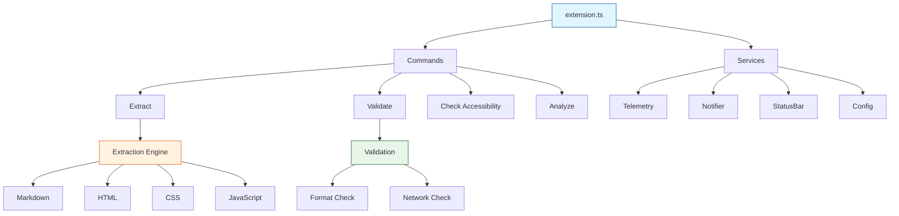
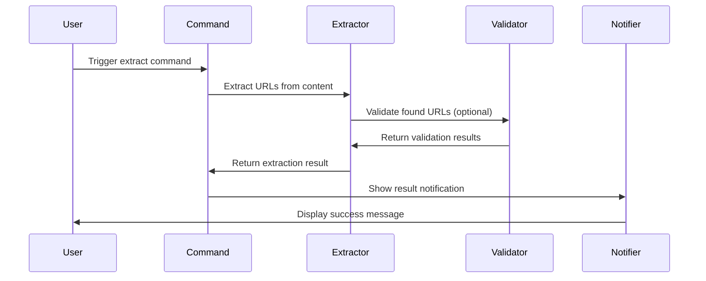

# URLs-LE Architecture

## Design Principles

**Functional First**: Pure functions with explicit return types, `readonly` types throughout, `Object.freeze()` for immutability, factory functions over classes.

**Performance & Safety**: Lightweight resource usage, built-in safety checks for large files, cancellation support, memory-efficient streaming.

**Developer Experience**: Unobtrusive defaults (silent by default), cross-platform compatibility, keyboard and screen reader support, full internationalization.

## Code Quality Standards (Fortune 10 Enterprise-Grade)

### TypeScript Strict Mode

- Full strict mode enabled: `strict`, `noUncheckedIndexedAccess`, `exactOptionalPropertyTypes`
- 100% type safety with proper null guards
- No implicit any types
- Explicit return type annotations on all functions

### Code Patterns

- **Early Returns**: Guard clauses at function entry, no nested if-else chains
- **Fail Fast**: Validate inputs immediately, return early on invalid conditions
- **Composition**: Factory functions over classes (except PerformanceMonitor with documented justification)
- **Immutability**: `Object.freeze()` on all exported objects, `readonly` types throughout

### Naming Conventions

- **Functions**: Singular, descriptive verbs (`extractUrl`, `validateFormat`, `handleError`)
- **Variables**: Clear, descriptive names with consistent prefixes (`isValid`, `hasError`, `shouldProcess`)
- **Constants**: UPPER_SNAKE_CASE for module-level constants
- **Consistency**: Same patterns across all modules

### Error Handling

- **Minimal try-catch**: Only for external APIs (parsers, file system, network)
- **No defensive programming**: Use type system and early returns instead
- **Clear error messages**: User-friendly with actionable suggestions
- **Categorized errors**: Parse, validation, safety, operational, file-system, configuration

## System Architecture



## Component Responsibilities

### 1. Extension Entry (`src/extension.ts`)

Minimal activation with dependency injection:

```typescript
export function activate(context: vscode.ExtensionContext): void {
  const telemetry = createTelemetry()
  const notifier = createNotifier()
  const statusBar = createStatusBar(context)

  registerCommands(context, { telemetry, notifier, statusBar })
  registerCodeActions(context)

  telemetry.event('extension-activated')
}
```

**Role**: Service wiring, command registration, code actions, disposable management.

### 2. Command System (`src/commands/`)

Factory pattern with progress and cancellation:

```typescript
export function registerExtractCommand(
  context: vscode.ExtensionContext,
  deps: Readonly<CommandDependencies>,
): void {
  const disposable = vscode.commands.registerCommand('urls-le.extractUrls', async () => {
    await vscode.window.withProgress(
      {
        location: vscode.ProgressLocation.Notification,
        title: 'Extracting URLs...',
        cancellable: true,
      },
      async (progress, token) => {
        const config = createConfiguration()
        const content = getActiveEditorContent()

        const result = await extractUrls(content, config, token)
        deps.notifier.show(result.summary)
      },
    )
  })

  context.subscriptions.push(disposable)
}
```

**Commands**: `extractUrls`, `validate`, `checkAccessibility`, `analyze`, `help`, `openSettings`

### 3. Configuration (`src/config/`)

Type-safe, frozen configuration:

```typescript
export function createConfiguration(): Readonly<Configuration> {
  const config = vscode.workspace.getConfiguration('urls-le')

  return Object.freeze({
    copyToClipboardEnabled: config.get('copyToClipboardEnabled', false),
    dedupeEnabled: config.get('dedupeEnabled', false),
    notificationsLevel: config.get('notificationsLevel', 'silent'),
    safetyEnabled: config.get('safety.enabled', true),
    safetyFileSizeWarnBytes: config.get('safety.fileSizeWarnBytes', 1000000),
    analysisEnabled: config.get('analysis.enabled', true),
    validationEnabled: config.get('validation.enabled', true),
    validationTimeout: config.get('validation.timeout', 5000),
  })
}
```

**Features**: Immutable objects, real-time updates via `onDidChangeConfiguration`, default values, type safety.

### 4. Extraction Engine (`src/extraction/`)

Format-specific extractors with pure functions:

```typescript
export function extractUrls(
  content: string,
  format: string,
  config: Readonly<Configuration>,
): Readonly<UrlExtractionResult> {
  const extractor = getExtractor(format)
  const urls = extractor.extract(content)

  return Object.freeze({
    urls: Object.freeze(urls.map((u) => Object.freeze(u))),
    totalCount: urls.length,
    format,
    timestamp: Date.now(),
  })
}
```

**Supported Formats**: Markdown, HTML, CSS, JavaScript/TypeScript, JSON, YAML

**Extraction Process**:

1. Format detection and validation
2. Pattern matching with pre-compiled regex
3. URL validation and normalization
4. Deduplication (optional)
5. Result formatting

### 5. Validation Engine (`src/utils/validation.ts`)

URL format and network validation:

```typescript
export function validateUrl(url: string): Readonly<ValidationResult> {
  try {
    const parsed = new URL(url)
    return Object.freeze({
      isValid: true,
      protocol: parsed.protocol,
      hostname: parsed.hostname,
      pathname: parsed.pathname,
    })
  } catch {
    return Object.freeze({
      isValid: false,
      error: 'Invalid URL format',
    })
  }
}
```

**Validation Types**: Format (using `URL` constructor), protocol whitelist, domain validation, path sanitization.

### 6. Analysis Engine (`src/utils/analysis.ts`)

URL pattern and security analysis:

```typescript
export function analyzeUrls(urls: ReadonlyArray<Url>): Readonly<AnalysisResult> {
  return Object.freeze({
    domainAnalysis: Object.freeze(extractDomains(urls)),
    patternAnalysis: Object.freeze(analyzePatterns(urls)),
    securityAnalysis: Object.freeze(analyzeSecurity(urls)),
    summary: Object.freeze(createSummary(urls)),
  })
}
```

**Analysis Types**: Domain distribution, pattern detection, security issues (mixed content, suspicious patterns), accessibility checks.

### 7. Safety System (`src/utils/safety.ts`)

Resource exhaustion prevention:

```typescript
export function shouldCancelOperation(
  processedItems: number,
  threshold: number,
  startTime: number,
  maxTimeMs: number,
): boolean {
  return processedItems > threshold || Date.now() - startTime > maxTimeMs
}
```

**Safety Features**: File size warnings, processing time limits, memory monitoring, URL count thresholds, user confirmation for large operations.

## Data Flow

### URL Extraction Pipeline



### Error Handling Flow

1. Error occurs during processing
2. Categorize by type (parse, validation, safety, network, file-system)
3. Determine severity (info, warning, error, critical)
4. Select recovery action (retry, skip, abort, user-input)
5. Notify user with context
6. Log to telemetry (local only)

## Service Dependencies

### Dependency Injection Pattern

```typescript
interface CommandDependencies {
  readonly telemetry: Telemetry
  readonly notifier: Notifier
  readonly statusBar: StatusBar
}

export function registerCommands(
  context: vscode.ExtensionContext,
  deps: Readonly<CommandDependencies>,
): void {
  registerExtractCommand(context, deps)
  registerValidateCommand(context, deps)
  registerAnalyzeCommand(context, deps)
}
```

**Why**: Testing with mocks, clear dependency graph, loose coupling, composition over inheritance.

## File Organization

```
src/
├── extension.ts          # Activation entry point
├── types.ts              # Centralized type definitions
├── commands/             # Command implementations
│   ├── extract.ts
│   ├── validate.ts
│   └── analyze.ts
├── config/               # Configuration management
│   └── config.ts
├── extraction/           # URL extraction logic
│   ├── extract.ts
│   └── formats/
│       ├── markdown.ts
│       ├── html.ts
│       ├── css.ts
│       └── javascript.ts
├── providers/            # VS Code providers
│   └── codeActions.ts
├── utils/                # Utility services
│   ├── validation.ts
│   ├── analysis.ts
│   ├── safety.ts
│   └── errorHandling.ts
├── ui/                   # User interface
│   ├── notifier.ts
│   └── statusBar.ts
└── telemetry/            # Local telemetry
    └── telemetry.ts
```

## Performance Strategy

**Memory**: Streaming for large files, efficient regex patterns, memory cleanup, configurable thresholds
**CPU**: Pre-compiled patterns, caching validation results, parallel processing, cancellation support
**Network**: Request batching, connection pooling, timeout handling, retry logic

## Security & Privacy

**Local-Only**: No external data transmission (validation is optional), local telemetry only, no data collection
**Input Validation**: Safe URL parsing, injection prevention, XSS prevention, safe error handling
**Privacy Protection**: User data stays in VS Code, configurable privacy settings, transparent telemetry

## Testing Approach

**Coverage Target**: 80% minimum across branches, functions, lines, statements
**Test Types**: Unit (pure functions), integration (workflows), performance (large files), accessibility, error handling
**Framework**: Vitest with V8 coverage provider

### Performance Monitoring Classes

**Decision**: Use classes for `PerformanceMonitor` and `PerformanceTracker` instead of factory functions.

**Rationale**:

- Stateful performance tracking requires encapsulated mutable state (timers, metrics)
- Class lifecycle methods (`startTimer`/`endTimer`) provide clearer semantics than closures
- Internal state mutations are intentionally hidden from consumers
- Created via factory function `createPerformanceMonitor()` to maintain consistency with codebase patterns

**Scope**: Limited to performance utilities only. All other services use factory functions.

**Trade-off**: Deviation from pure functional pattern, but classes provide better encapsulation for this specific use case.

## Refactoring Decisions (2025)

### Extraction Pipeline Refactoring

- **Before**: Large monolithic function with nested switches and try-catch blocks
- **After**: Composed functions with early returns, fail-fast validation, clear single responsibilities
- **Benefits**: Easier to test, clearer flow, better error messages, reduced cognitive load

### Command Refactoring

- **Before**: Deep nesting with multiple if-else chains, complex error handling
- **After**: Extracted helper functions, early returns, composition over nesting
- **Benefits**: Linear flow, easier to understand, better separation of concerns

### URL Validation Refactoring

- **Before**: Inline validation logic, repeated patterns, unclear function names
- **After**: Extracted validation functions, clear naming (`isValidMailto`, `isValidWebUrl`), pattern constants
- **Benefits**: Reusable validation logic, consistent patterns, better testability

### Configuration Management Refactoring

- **Before**: Inline config reading with magic numbers, no validation
- **After**: Centralized defaults, constrained number validation, clear helper functions
- **Benefits**: Type-safe configuration, validated constraints, easier to maintain

### Error Handling Simplification

- **Before**: Complex error categorization with nested conditions, many unused features
- **After**: Simple pattern matching, clear categorization functions, removed unused code
- **Benefits**: Easier to understand, faster execution, clearer error messages

### Type Safety with exactOptionalPropertyTypes

- **Challenge**: TypeScript's `exactOptionalPropertyTypes` requires explicit handling of optional properties
- **Solution**: Use spread operator with conditional inclusion: `...(value && { property: value })`
- **Benefits**: Compile-time safety, no runtime undefined values, clearer intent

## Design Rationale

### Why Separate Validation from Extraction?

- **Performance**: Network validation is slow
- **Flexibility**: Users may want extraction without validation
- **Optional**: Not all use cases need validation
- **User Control**: Configurable via settings

### Why Domain Analysis?

- **Insights**: Understand external dependencies
- **Security**: Identify suspicious domains
- **Documentation**: Auto-generate API documentation
- **Refactoring**: Find hardcoded URLs for configuration

### Why Accessibility Checks?

- **Compliance**: WCAG guidelines compliance
- **User Experience**: Better link descriptions
- **SEO**: Search engine optimization
- **Best Practices**: Encourage accessible coding

### Why Local-Only Processing?

- **Privacy**: User data never leaves VS Code
- **Trust**: No external dependencies
- **Speed**: No network latency
- **Reliability**: Works offline

---

**Related:** [Commands](COMMANDS.md) | [Configuration](CONFIGURATION.md) | [Testing](TESTING.md) | [Performance](PERFORMANCE.md)
